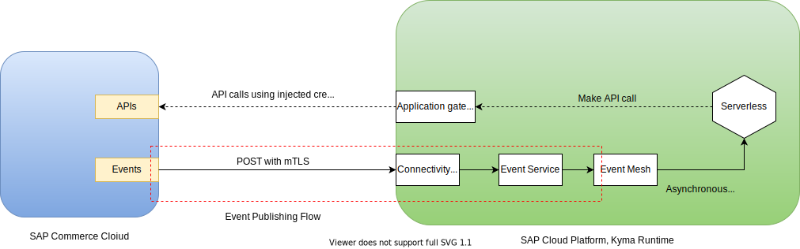
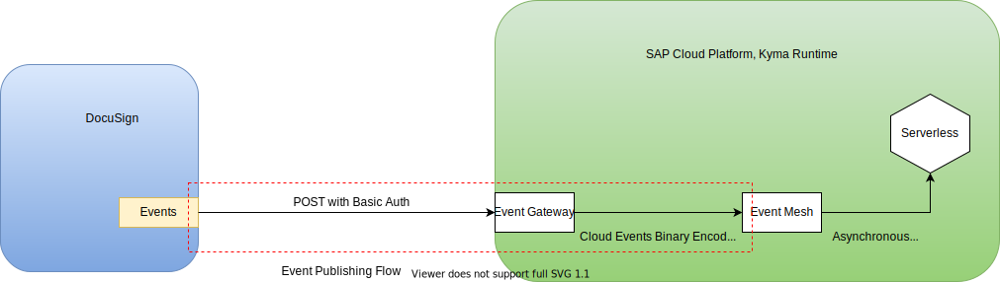
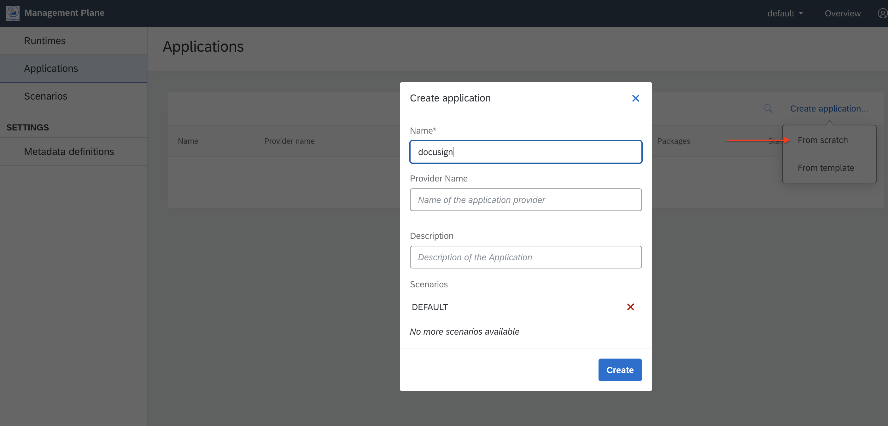
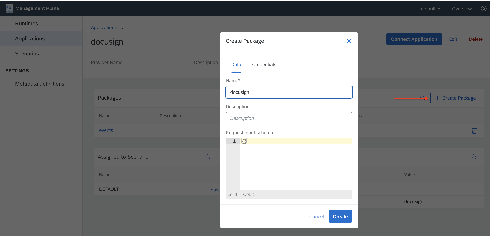
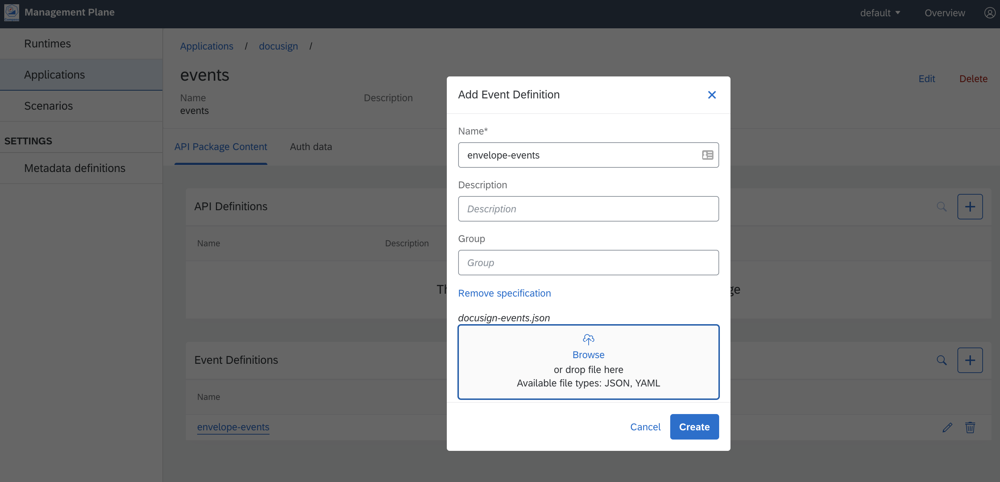

# Overview

Ingest events from docusign and forward to event mesh.

How it works for solutions that have implemented the application connector protocol?


How we do a workaround for docusign?


## Kyma install

* Disable legacy mode when installing kyma. <https://kyma-project.io/docs/components/runtime-agent#installation-installation>
* Install Kyma with runtime agent enabled.

## Compass install

* Install compass. <https://github.com/kyma-incubator/compass/blob/master/docs/compass/04-01-installation.md#single-cluster-with-compass-and-runtime-agent>
  * copy overrides from `kyma-installer` namespace

    ```shell script
    kc get cm -n kyma-installer disable-legacy-connectivity-override -o yaml > ~/test/disable-legacy-connectivity-override.yaml
    kc -n kyma-installer get cm net-global-overrides -o yaml > ~/test/net-global-overrides.yaml
    ```

  * Adjust them and apply to compass-installer

    ```shell script
    kc -n compass-installer apply -f ~/test/disable-legacy-connectivity-override.yaml
    kc -n compass-installer apply -f ~/test/net-global-overrides.yaml
    ```

  * Install compass

    ```shell script
    export INSTALLATION_OPTION=master
    kubectl apply -f "https://storage.googleapis.com/kyma-development-artifacts/compass/${INSTALLATION_OPTION}/compass-installer.yaml"
    ```

* Access compass at <https://compass.{kyma cluster domain}/>

## Set up

* Create an application in compass
  

* Add event metadata. [Example Asycn API Spec](assets/docusign-events.json)
  
  

## Deploy docusign-event-gw

Refer to [the instructions](./docusign-event-gw/README.md#deploy-on-kyma-cluster)

## DocuSign Side setup

* Set up a `Custom Connect Configuration` in DocuSign Admin console.
  * Use the `URL+'/events'` in the configuration.
  * Provide BasicAuth as configured in the event gateway.

## Manualy Testing

Send events to event mesh using `cURL`

```shell script
curl -X POST https://docusign-event-gw.{cluster domain} -v \
--user '{username}:{password}' -d @./docusign-event-gw/test-data/1.xml
```

```shell-script
# send dummy events internally inside cluster directly to mesh
curl -v -H "Content-Type: application/json; charset=utf-8" -H "ce-specversion: 1.0" -H "ce-type: docusign.envelope.completed" -H "ce-eventtypeversion: v1" -H "ce-id: 1234-1234-1234" -H "ce-source: docusign" -X POST -d '{"orderCode" : "1234"}' http://docusign
```
